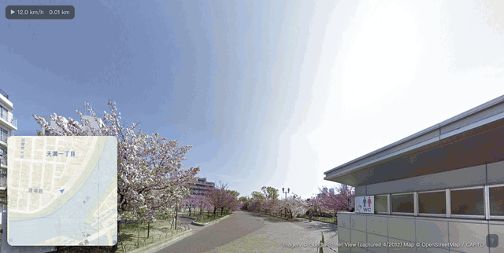
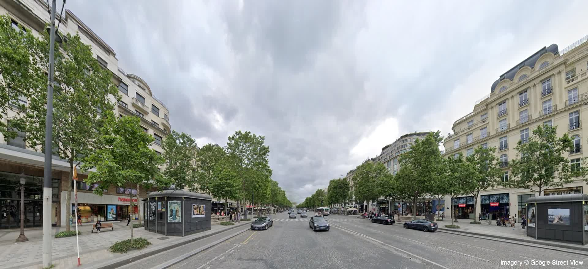
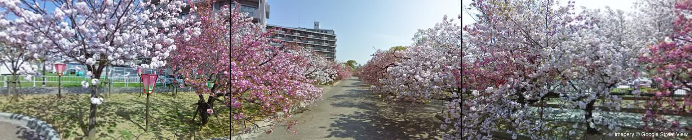
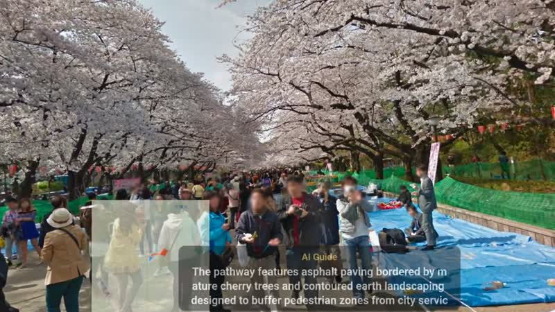
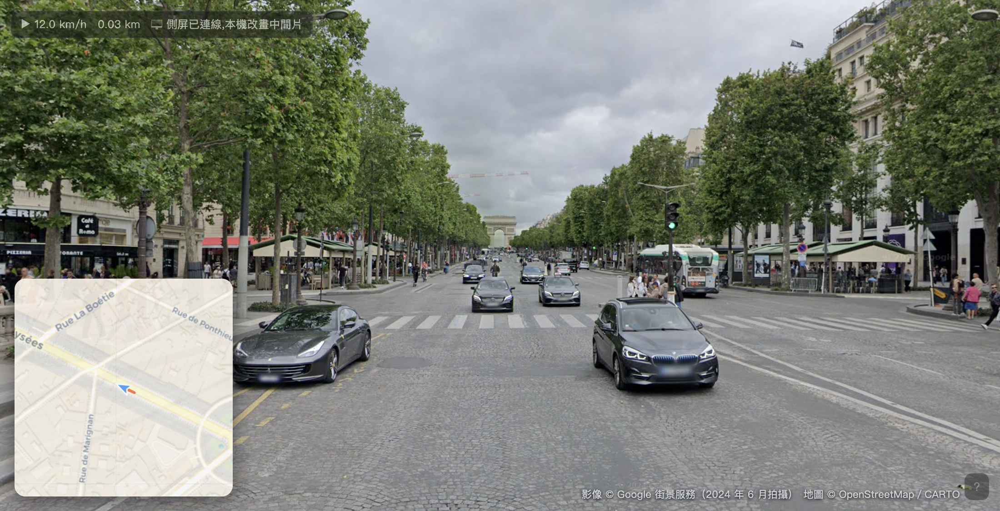
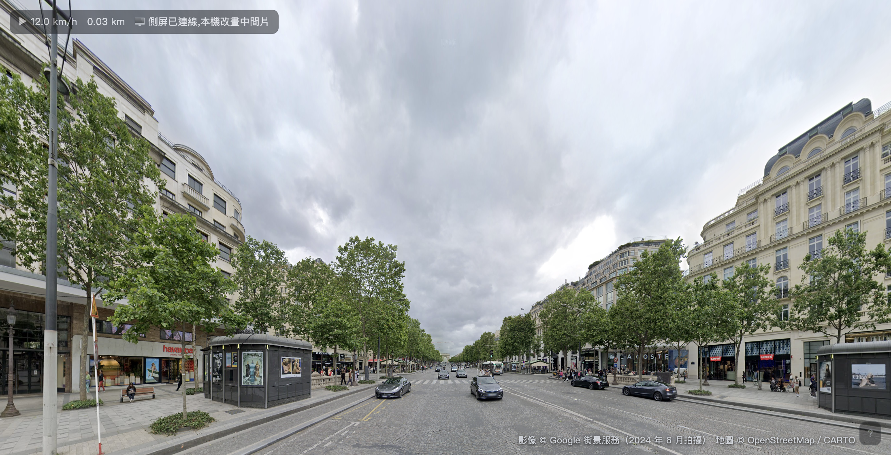

# pano-runner

A self-hosted **virtual treadmill runner**: it renders Street View panoramas with its own WebGL pipeline — no map SDK, no iframe — and turns them into a smooth first-person run you control with your voice, your footsteps, or a VR headset.

[繁體中文說明 → README.zh-TW.md](README.zh-TW.md)

[](https://buymeacoffee.com/ericchen1115)



*Osaka Mint sakura tunnel, April 2012 historical imagery — one of the built-in "time machine" trails.
The GIF is 6 fps for size — [**watch the true 30 fps capture**](docs/demo-30fps.mp4) to see the actual motion.*

## One engine, three ways to run

**1. One (ultra)wide screen** — seamless 200°+ Panini projection: no seams, straight verticals, works on any monitor:

[](docs/wide-screen.mp4)

*▶ Click to watch — Champs-Élysées toward the Arc de Triomphe (15s).*

**2. Three screens around your treadmill** — two spare machines open `/left` and `/right`, and you get a synchronized 210° wraparound:

[](docs/triple-screen.mp4)

*▶ Click to watch the three panels running in sync (15s).*

**3. A VR headset** — full WebXR stereo with in-headset minimap, subtitles and the AI tour guide:

[](docs/vr-capture.mp4)

*▶ Click for the in-headset Quest 1 capture (56s, with the English AI tour-guide audio) — Ueno Park in full bloom.*

## Why it exists

Consumer Street View caps you at a ~90° window inside someone else's UI. Fetching the raw panorama tiles and projecting them yourself removes every one of those walls: any field of view, seamless ultra-wide projection, multi-screen 210° setups, WebXR stereo, custom transitions between panoramas — all from the same data.

This is a personal research project. See [Data sources & fair use](#data-sources--fair-use) before you run it.

## Features

- **Own WebGL renderer** — panorama tiles → sphere → rectilinear / cylindrical / hybrid Panini projection. Continuous 200°+ ultra-wide with straight verticals, or classic 3/5/7-panel walls.
- **Runs like running** — speed from a slider, a microphone listening to your treadmill footsteps (cadence detection), VR hand-swing, head-bob, thumbstick — or **real treadmill metrics via [QZ](https://github.com/cagnulein/qdomyos-zwift)** (speed + heart rate over OSC).
- **Voice control** (English & zh-TW, auto-selected) — "turn left", "turn around", "run to Central Park", "describe", "stop running".
- **Tour guide built in** — nearby landmarks fetched from Wikidata/Wikipedia with photos, narrated with Google TTS and synced subtitles.
- **AI live guide** — no landmark data? One command sends the current view + GPS facts to Gemini, which improvises a grounded, hallucination-resistant intro — while the view *rewinds* along your path so the narration starts exactly where you asked.
- **WebXR** — full stereo rendering on Quest-class headsets, with in-headset minimap, subtitles, thumbstick steering and stick-forward locomotion. Battle-tested on a Quest 1.
- **Multi-screen** — one master + side panels over BroadcastChannel (same machine) or SSE (any machine on your LAN: open `/left` and `/right`, zero config). Interpolation buffer makes Wi-Fi followers as smooth as local ones.
- **Time machine** — lock the month (cherry-blossom April, autumn November, snow February) and the runner auto-switches to historical imagery where available; curated "rails" replay one continuous era end-to-end.
- **GPX export** of every run.
- **English & Traditional Chinese UI** — auto-detected from your browser (`?lang=en` to force).





## Quick start

```bash
node server.mjs
# open http://localhost:8877  → pick a start point on the map, press 開始跑
```

Requirements: Node 20+, Chrome. No build step, no dependencies.

Optional integrations (each degrades gracefully if absent):

| What | How |
|---|---|
| Google TTS narration | `~/.keys/mapskey` — a Google Cloud API key with Text-to-Speech enabled |
| Gemini AI guide | `~/.keys/geminikey` — a Gemini API key |
| Wikimedia politeness | `PANO_CONTACT=you@example.com` env var (goes into the User-Agent, per Wikimedia policy) |
| VR | open the printed `https://<lan-ip>:8878` URL from the headset browser (self-signed cert in `cert/`) |
| Real treadmill speed | Two ways: **direct Bluetooth** — click "🏃 Connect treadmill" on the run page (Chrome, FTMS treadmills) — or [QZ](https://github.com/cagnulein/qdomyos-zwift) with OSC output set to `<server-ip>:9005` (port: `PANO_QZ_PORT`, works for VR too). Speed takes over automatically; falls back after 4s of silence. *QZ path protocol-verified on Linux by [@cagnulein](https://github.com/cagnulein) (QZ's author) — thanks!* |

## Architecture (600-line server, zero deps)

```
pano.mjs      data layer: pano search / metadata / tiles
server.mjs    static files + proxies (tiles, photos, map tiles) + TTS + AI guide + multi-screen sync hub
wiki.mjs      Wikidata SPARQL landmark discovery w/ adaptive rate limiting
public/
  view.js     the renderer & runner (~2,700 lines: projection shaders, WebXR, voice, pacing, narration)
  launcher.js map-based route picker
  cadence.js  microphone footstep-rate → speed
  voice.js    zh-TW speech commands
tools/        rail builders, landmark cache warmers
```

Things that were hard and are documented in code comments: shared-world dissolve between panoramas, hybrid Panini projection (C1-continuous rectilinear center + equidistant wings), Quest 1 stereo flicker (compositor depth reprojection), month-locked era graphs, network follower interpolation on sender clock.

## Data sources & fair use

- **Street View imagery** is fetched from Google's public tile endpoints **without an API key**. This is not covered by any Google license. The project exists for personal research and experimentation; **do not deploy it publicly or commercially**. If you need a legal footing, rebuild the view layer on the official Maps JavaScript API, or switch to openly-licensed imagery (Mapillary, KartaView).
- **Landmarks** come from Wikidata/Wikipedia (CC BY-SA — attribution shown in the UI), photos from Wikimedia Commons, map tiles from OpenStreetMap/CARTO.
- **TTS / Gemini** use your own API keys within your own quota.

You are responsible for how you use this code.

## Support

If this project made your treadmill less boring: [Buy me a coffee ☕](https://buymeacoffee.com/ericchen1115)

## License

MIT (code only — the data sources above keep their own licenses).
